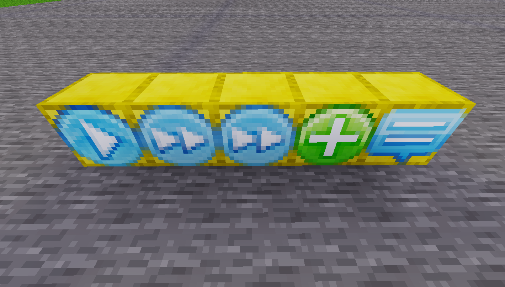

# Basic concept

An epic consists of several functions.

A function is basically a bunch of blocks that get executed **from left to right**:

A function starts with a [function](./blocks/function.md) block and ends implicitly on the end of the blocks.

Functions can be called with a [call](./blocks/call.md) or an [epic](./blocks/epic.md) block, the position of the called function is not relevant.
It can be on the other side of the world if needed...
Functions can also call each other or themselfes (but be cautious with that!)

The [epic](./blocks/epic.md) block acts as a starting point for players and executes a function
at the specified position.

# Abort/Exit hooks

Hooks are placeable blocks that point to a function that gets executed
in certain cases:

The *abort* hook is called if the player aborts or dies:
* On death
* On disconnect
* On `/epic_abort`

The *exit* hook runs on every abort/exit condition:

* Main epic finished
* Player death
* Player logout
* Manual abort with `/epic_abort`

The *exit* hook is intended for cleanup or revert operations, such as:

* Reset skybox
* Reset position of player
* etc.

# Function composition

Function can be (and should) be grouped to logical units, see [best practices](./best-practices.md).
