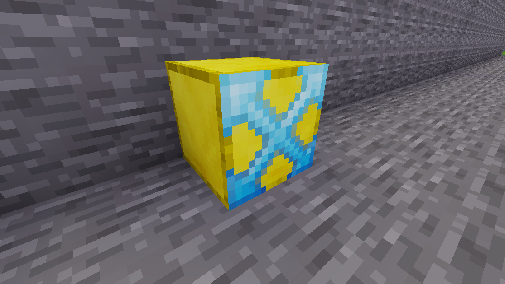

# Branch

## Usage

An `epic:branch` block checks the other conditional blocks to the right and
branches into the first block that is successful.

This is usefull for if/then cases:

* *if* the player is in [location](./waypoint.md) *then* [spawn mob](./spawn_mob.md)

## Example

See: [example quest](../example.md)
