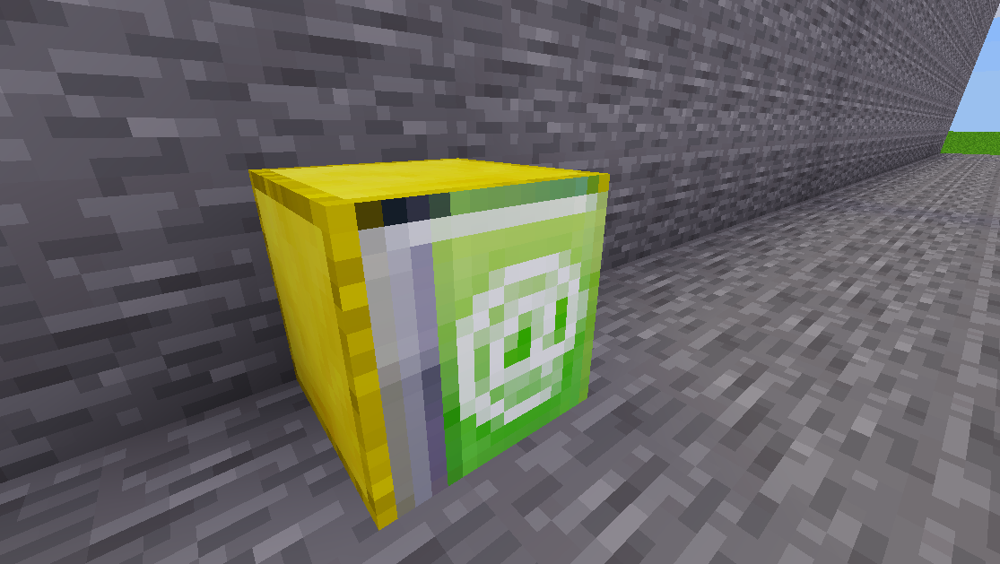

# Call

Calls another *function* or *epic* upon execution.
After the other function returns, the commands resume on this position (if any available)

Other *epic* blocks can only be called if the current execution is stopped after that
(last block in chain)

