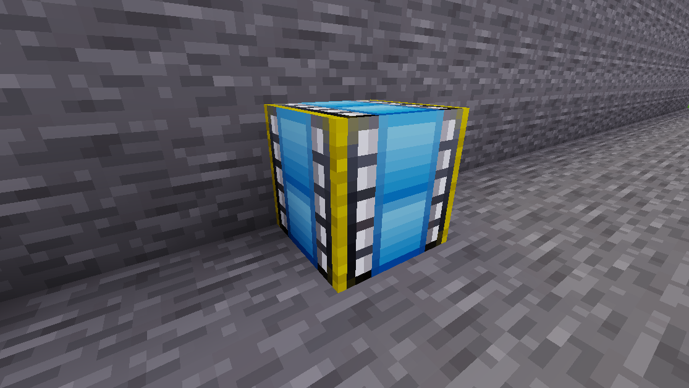

# Epic starter

Main starter block.

Configure your *main*, *abort* and *exit* functions here.

## Linkable blocks

The following blocks can be linked to with an `epic:epic` block:

* `epic:function` with *main* / *abort* and *exit*
* `epic:epic` with *main* only
  * useful for "display-only" epic blocks which start another one in a remote location

## Links

* [example quest](../example.md)
* [Exit-Functions](../exit-functions.md)
