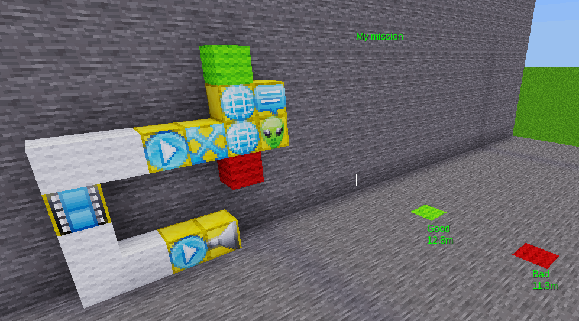
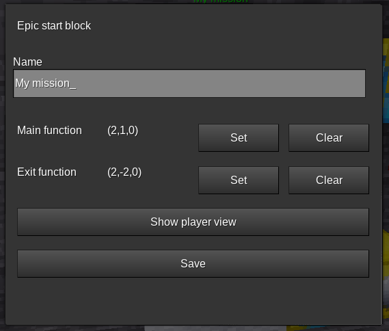
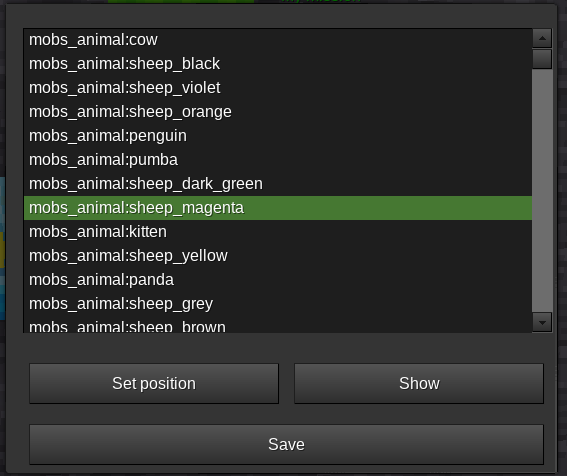
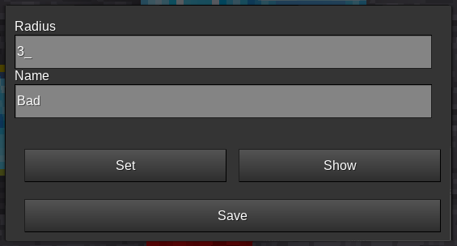
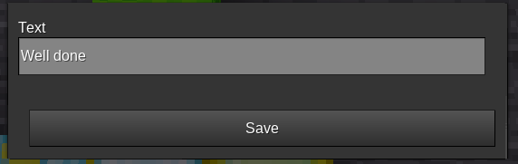
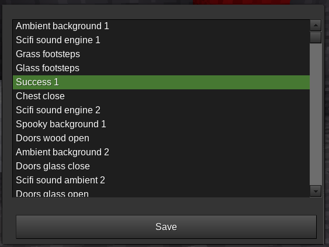

# Simple Quest example

An example quest with 2 outcomes, depending which waypoint was triggered.

The setup:

 **Note:** The wool is purely decorative!

* Left: The starter/configuration block (the player can start here)
* Connected with white wool:
  * On the top: the main mission
  * On the bottom: the "exit"-function, it gets called for cleanup when the mission is done
* Green wool: The "good" way (gets triggered if the player enters the configured zone)
* Red wool: The "bad" way
* "Alien face block" spawns a mob at the desired position

The [Epic](./blocks/epic.md) configuration:

The mob configuration:

The waypoint config:

The chat message to show on exit:

The sound to play on exit:

