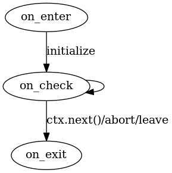

# Execution model

## Node definition

```lua
minetest.register_node("example:node", {
  epic = {
    on_enter = function(pos, meta, player, ctx)
      -- executed on block-entry once
    end,

    on_check = function(pos, meta, player, ctx)
      -- executed periodically until either ctx.next() or ctx.exit() called
    end,

    on_exit = function(pos, meta, player, ctx)
      -- executed once on block-exit (for cleanups)
    end
  }
})
```

## Context definition

```lua
ctx = {
  -- next block
  next = function() end,

  -- call another function at pos
  call = function(pos) end,

  -- sets the current epic timeout
  settimeout = function(seconds) end,

  -- data for block-execution lifetime
  step_data = {},

  -- data for the entire epic execution
  data = {}
}
```

## Lifecycle



## Per-step data

```lua
step_data = {}
```

## Shared data for epic execution

```lua
data = {}
```
