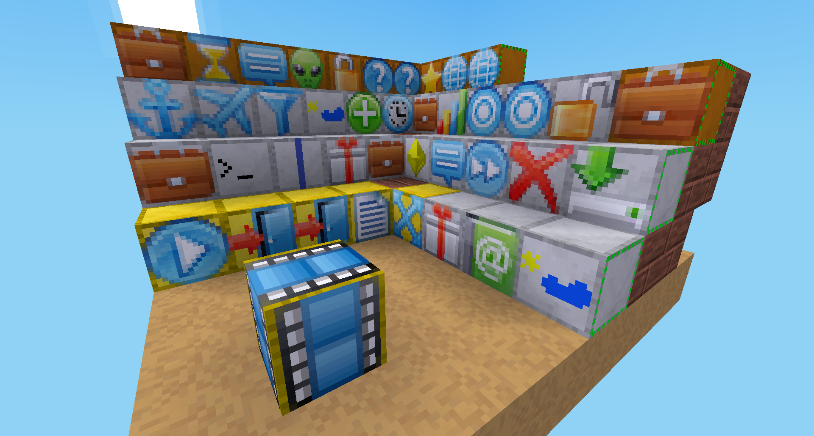

epic -- Enhanced Programmer for Ingame Control
-----------------

A mod for [minetest](http://www.minetest.net)

# Overview

Create and program missions or quests by placing and configuring blocks.

Successor of the [missions](https://github.com/thomasrudin-mt/missions) mod.

# Links

* Github: https://github.com/damocles-minetest/epic
* Issues: https://github.com/damocles-minetest/epic/issues
* ContentDB: https://content.minetest.net/packages/BuckarooBanzay/epic/
* Forums: https://forum.minetest.net/viewtopic.php?f=9&t=23558

# Features

* Create missions or quests with player interaction
* Audio and Visual effects (skybox, background-sounds, etc)
* Environment manipulation (set node, remove node)
* Inventory manipulation
* Waypoints
* Teleporting
* Spawn mobs
* Send messages
* Execute commands
* Simple control flow (no lua coding needed)
* Conditional branching (for example: "if player is *there* then execute *that*")
* 3rd-party mod integrations (mobs, signs, mesecons)

# Demo

For a demo visit the [Damocles](https://damocles.minetest.land) server.

# Compatibility

* Minetest >= 5.0

# Manual

* [Basic concept](doc/basic-concept.md)
* Available [blocks](doc/blocks.md)
* Simple Quest [example](doc/example.md)
* [Privilieges](doc/privs.md)
* [Chat commands](doc/chatcommands.md)
* [Best practices](doc/best-practices.md)
* [Area commands](doc/area-commands.md)

# Dependencies

Mandatory:
* default
* screwdriver

Optional:
* mobs
* mesecons
* digilines
* player_monoids
* soundblock
* monitoring
* signs

# Plugins

* More skyboxes: https://github.com/damocles-minetest/epic_skybox
* Weather control: https://github.com/damocles-minetest/epic_weather

# Settings

* **epic.log_executor** (bool, false) logs executor internals to the action log
* **epic.hud.offsetx** (float) hud x offset
* **epic.hud.offsety** (float) hud y offset
* **epic.build_restrictions** (bool, false) if true you need the `epic_builder` priv to place epic blocks

# Portability notes

All coordinates are stored relative in the blocks.
This makes it possible to copy your creations in the same or across worlds with WorldEdit or a similar tool.

# Technical docs

* [Mod integration](doc/mod-integration.md)
* [Executor hooks](doc/executor_hooks.md)
* [Executor](doc/executor.md)
* [State](doc/state.md)

# Licenses

## Code

* MIT

## Assets

* default_steel_block.png / epic_node_bg.png / epic_mese_crystal.png
  * CC BY-SA 3.0 https://github.com/minetest/minetest_game

* 16x16 Icons in `textures/*`
  * CC BY-SA 3.0 http://www.small-icons.com/packs/16x16-free-toolbar-icons.htm
  * CC BY-SA 3.0 http://www.small-icons.com/packs/16x16-free-application-icons.htm

* Other textures
  * CC BY-SA 3.0
